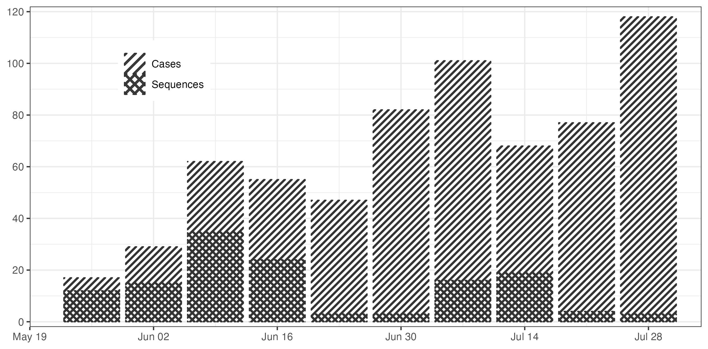

# Sierra Leone EBOV analysis
Bernardo Gutierrez

TimTam2 analysis of a data set describing the early EBOV epidemic in two eastern provinces in Sierra Leone, Kailahun and Kenema. This outbreak followed shortly after the introduction of the virus into the country and corresponds to a period where cases were growing exponentially, and where a portion of the cases were sequenced. This [`summary`](https://github.com/BernardoGG/ebov-expgrowth-example/blob/main/extractData.md) presents a detailed description of the data. From here, the current analysis focuses on the following:

- Dataset B from the original analysis.
- Data available from May 19 2014 to August 3 2014.

The distribution of cases and sequences is shown below (plot generated w)

## Script inventory and usage

- [TimTam_EBOV_DataWrangling.R](TimTam_EBOV_DataWrangling.R): Import case data, sequence data and metadata, and generate data frames to be further used for subsequent analyses.
- [TimTam_EBOV_epi_plots.R](TimTam_EBOV_epi_plots.R): Generate summary plot with numbers of cases and sequences per week in eastern Sierra Leone.
- [TimTam_EBOV_slam_dataset.R](TimTam_EBOV_slam_dataset.R): Uses the TimTamSlam package to distribute weekly aggregated cases over days per epidemiological week.

Remaining R scripts are not used on the main analysis pipeline, they were used for preliminary tests.

## Results

- Sequencing was performed over the entirety of the study period. A larger proportion of cases were sequenced during June; epidemic growth continued through July with fewer numnbers of sequences produced.

